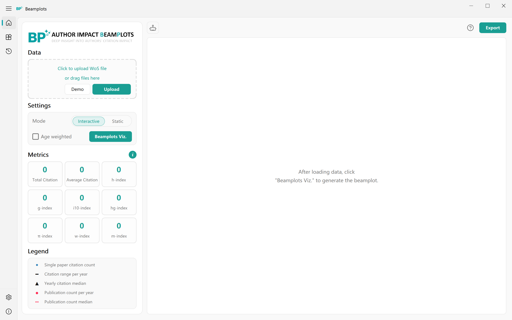

<div align="center">


# Beamplots

[English](README_EN.md) · **中文**

**用 beamplot 看单个研究者的发文、被引与时间轨迹**

[](https://www.python.org/)
[](https://www.qt.io/)
[](LICENSE)
[](https://github.com/oscimetrix-garden/Beamplots)

[项目简介](#项目简介) ·
[界面](#界面) ·
[功能特性](#功能特性) ·
[快速开始](#快速开始) ·
[开发者](#开发者) ·
[许可证](#许可证)

</div>

## 项目简介

Beamplots 是桌面软件（当前代码版本 0.1.0）。它读取 Web of Science 导出的题录（`.txt` / `.ciw` / `.wos`），取出发表年（`PY`）和被引次数（`TC`），画出 beamplot，并计算一组常用文献计量指标。

h-index 把复杂表现压成一个数。Beamplot 同时给出每年发文量、被引分布、中位数和学术生涯上的时间变化。方法见 Haunschild、Bornmann 与 Adams 的工作；本仓库用 Python 实现，统计口径与 R 包 `BibPlots` 的 `beamplot()` 对齐，可选年龄加权。

仓库内带有 Robin Haunschild 的 WoS 示例数据，可直接点 Demo 试跑。在 Settings 里配置大模型后，可对当前图和选中的数据点提问。

## 界面

<div align="center">

</div>

## 功能特性

- 上传或拖入 WoS 文件/文件夹；内置 Demo 数据
- Interactive（Plotly）与 Static（Matplotlib）两种绘图模式
- 可选年龄加权：`TC / min(当年年份 − PY + 1, 11)`
- 侧栏指标：总被引、篇均被引、h / g / i10 / hg / π / w / m
- 交互图可点选或框选文献点，导出 HTML / PNG / PDF / SVG
- Publications 页查看、编辑题录；History 保存作图记录
- 中英文界面、亮色/暗色主题
- 配置 LLM 后，可就当前数据集和图表选择做问答

## 快速开始

环境：Windows 10/11，Python 3.10 或更高版本。

```bash
pip install -r requirements.txt
python main.py
```

依赖见 `requirements.txt`。API Key 写在本地 `src/assets/api_keys.json`（已加入 `.gitignore`，不要提交）。

## 开发者

- Jie Li, National Science Library, Chinese Academy of Sciences, China（lijie2022@mail.las.ac.cn）
- Xian Li, National Science Library, Chinese Academy of Sciences, China（lixian@mail.las.ac.cn）
- Robin Haunschild, Max Planck Institute for Solid State Research, Germany（R.Haunschild@fkf.mpg.de）

主要参考文献：

- Haunschild, R., Bornmann, L., & Adams, J. (2019). R package for producing beamplots as a preferred alternative to the h index when assessing single researchers (based on downloads from Web of Science). *Scientometrics*, 120, 925–927.
- Bornmann, L., & Haunschild, R. (2018). Plots for visualizing paper impact and journal impact of single researchers in a single graph. *Scientometrics*, 115(1), 385–394.

## 许可证

本仓库采用 [Apache License 2.0](LICENSE)。
